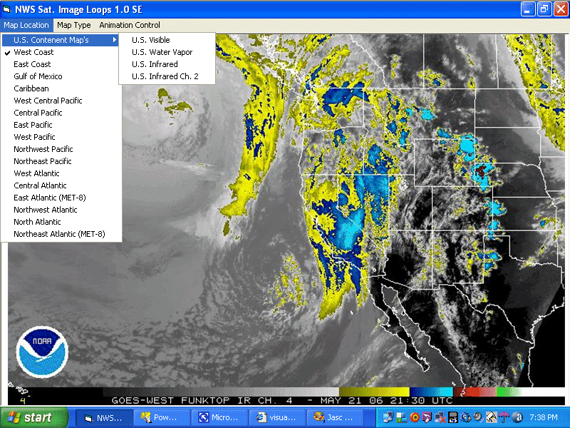



## NWS Sat Loop 1\.0 SE \(Update 2\)

### Description

Well thanks to the parsing routine I worked out the other day we have satellite loops again. A special thanks also goes out to the NWS Satellite Services Division, for the new well organized server file system. Without their updates this program wouldn't have been possible. Images automatically update on 2 Min. after the quarter of every hour provided your system clock is accurate. If your running XP this shouldn't be an issue. You may need to run down the GDI resize DLL. For it is required for this program to run. If their are any unforeseen issues that I might have overlooked please feel free to post it. I sincerely hope everyone enjoys this new code &amp; puts it to good use. Please let me know of any improvements you might make, I would love to see them. Update 1: I added the U.S. Continent map's &amp; a map advance speed selector. As well as making the change that xim suggested. Update 2: I added 'Freeze on latest image'.
 
### More Info
 

             |
---                |---
**Submitted On**   |2006-05-21 17:19:24
**By**             |[Thomas Swift](https://github.com/Planet-Source-Code/PSCIndex/blob/master/ByAuthor/thomas-swift.md)
**Level**          |Intermediate
**User Rating**    |5.0 (45 globes from 9 users)
**Compatibility**  |VB 6\.0
**Category**       |[Internet/ HTML](https://github.com/Planet-Source-Code/PSCIndex/blob/master/ByCategory/internet-html__1-34.md)
**World**          |[Visual Basic](https://github.com/Planet-Source-Code/PSCIndex/blob/master/ByWorld/visual-basic.md)
**Archive File**   |[NWS\_Sat\_Lo1996065212006\.zip](https://github.com/Planet-Source-Code/thomas-swift-nws-sat-loop-1-0-se-update-2__1-65414/archive/master.zip)

